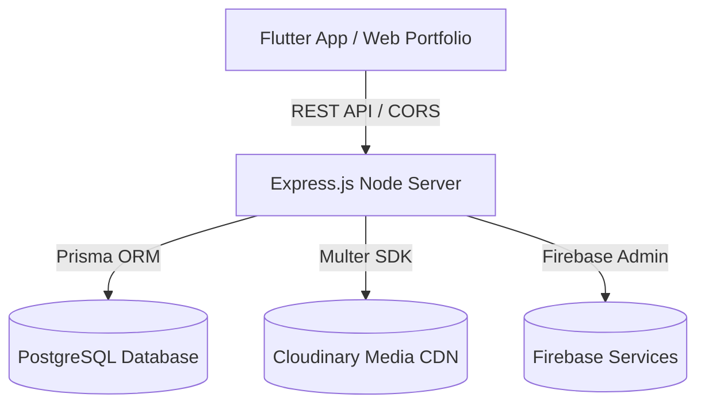

# Project Architecture

## Technical Stack Overview

## Backend Infrastructure
- **Core Web Framework:** Node.js with Express.js
- **Database & ORM:** PostgreSQL managed via Prisma ORM (`prisma/schema.prisma`)
- **Photo & Media Storage:** Cloudinary integration (`/api/media/upload`) with Multer
- **Firebase Services:** Firebase Admin SDK (`src/config/firebase.js`)
- **Security & Middleware:** Helmet, CORS origin validation, Morgan logger, centralized error handling
